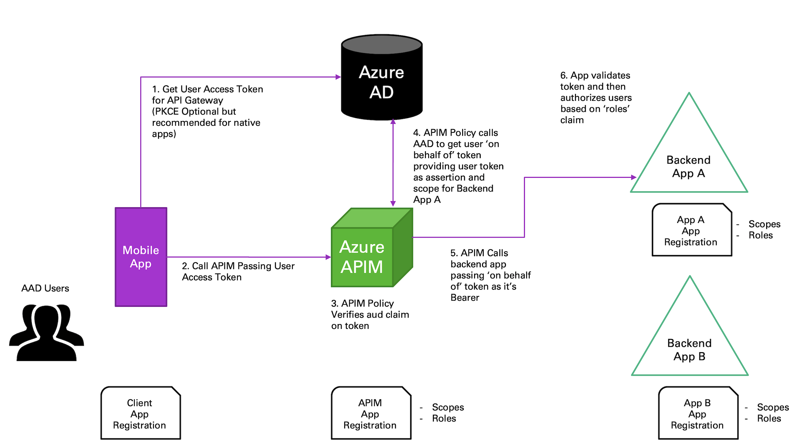
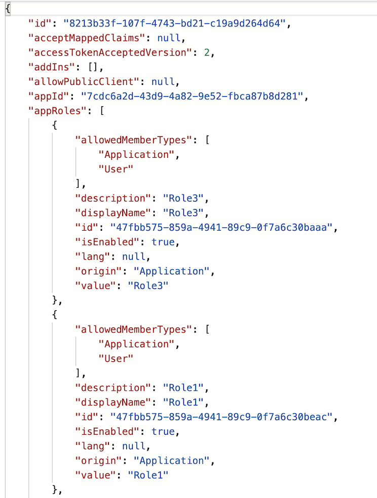
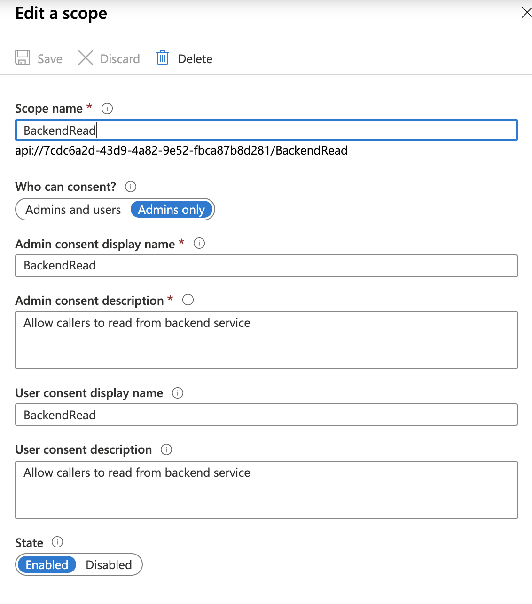

# Azure AD OAuth2 On-Behalf-Of with Azure API Management

One very common scenario for API Gateways (Azure APIM or other) is to have a user application (ex. Mobile App) authenticate the user and then make a call to the gateway which will in turn broker calls to the backend services. This allows you to leverage all of the benefits of your API Gateway (ex. Request Limits, Monitoring, Versioning, etc) for those backend services. While fundamentally the setup is pretty straight forward, it becomes a bit more complex if you want the backend services to authorize the user that is sitting on the other side of the gateway.

## The Flow

Fortunately, OAuth provides the 'on-behalf-of' (OBO) flow to enable exactly this situation. The flow looks like the following:

**Flow steps:**
>Note: The flow above is based on Azure AD as the identity provider. In Azure AD every actor in this flow has their own identity. Users are represented as Azure AD Users, and the applications, including the API Gateway, each get an Azure AD Application Registration.

1. User opens the mobile application and the application starts the OAuth [code grant flow](https://docs.microsoft.com/en-us/azure/active-directory/develop/v2-oauth2-auth-code-flow). This flow involve two calls. First is a request to get an authorization code. The authorization code is where the actual user sign in takes place, depending on the platform the user will be popped out to a browser allowing them to sign in. The authorization code will be returned to the redirect URI specified in the call. This code is then used to call the token endpoint to get an access token (JWT) for the target application/scope.

    >Note: For native apps (i.e. Windows, iOS, etc) it's recommended you use PKCE (Proof Key for Code Exchange) in your authorization code/access token flow. This will help ensure that if a malicious actor intercepts your authorization code, they cannot use that to impersonate the user and request an access token to the target system. Details of how PKCE works are outside the scope of this doc, but Vittorio Bertocci from Auth0 has a great [video](https://auth0.com/docs/videos/learn-identity/05-desktop-and-mobile-apps) explaining PKCE.

1. Mobile app takes the access token and uses it as the Bearer token for the call to the API Gateway.

1. The API Gateway validates the JWT and confirms that the audience claim (aud) is correct.

1. This is where it gets interesting. The API Gateway wants to make a call to the backend on behalf of the calling user, but it doesn't have a valid JWT (i.e. a JWT with the correct claims) for the backend service. To get one the API Gateway calls the identity provider to request a token to the backend service providing its' credentials along with an assertion containing the access token passed from the caller. The identity provider can then validate the caller has access and return a new access token (JWT) with the end users claims for the backend service.

1. Now the API Gateway has a valid access token for the calling user for the backend service. It places that token in the Authorization header and executes the backend service call. 

1. Finally, the backend serivce will validate the access token and use the scope and role claims to authorize the end user request.

## The Implementation

So how do you actually set up a flow like this? For this walkthrough I'll be using Azure AD as the identify provider, Azure API Management as both the API Gateway and the backend service, and the Azure APIM developer portal and Postman as the client.

### Setting up Azure AD

The first thing you'll need is a valid Azure AD tenant. I'd recommend you create your own tenant where you can act as an administrator while you work through this, to avoid harassing your AAD Admin if you run into issues.

As noted above, every actor in this flow has it's own identity, so let's create those.

#### The Backend Service

1. In the Azure AD portal navigate to 'App Registrations'.

1. Click '+ New Registration'

1. Provide a name (ex. obo-backend-service), leave the rest as defaults and click 'Register'

1. From the 'Overview' page, make note of the App ID, as you'll need this later.

1. Once you're in your app registration, click on the 'Manifest' section. This is where we'll set OAuth version and optionally add user roles.

1. Set the accessTokenAcceptedVersion to 2

1. Add any custom roles you want for the application. More info on custom roles [here](https://docs.microsoft.com/en-us/azure/active-directory/develop/howto-add-app-roles-in-azure-ad-apps).

    

1. Go to the 'Expose API' section in the app registration, click '+ Add Scope' and create a scope for your backend application. For the consent, if you're the admin you can leave it to admin, but if not you should set 'Users and Admins'.

    

1. Make note of the fully qualified scope, as you'll need this later.

#### The API Gateway

Follow the same process as above to create an app registration for the API Gateway with two additional steps shown below:

1. Create the registration with an identifieable name (ex. obo-gateway) and make note of the App ID from the 'Overview' page

1. Edit the manifest to set the accessTokenAcceptedVersion and add any custom roles (See above).

1. Go to 'Expose an API', add a scope and make note of the fully qualified scope.

1. Additional Step: Click on 'Certificates & Secrets' and then click on '+ New Secret', provide a secret name and lifetime and click 'Add'. Make note of the secret value for later use.

1. Additional Step: Click on 'API Permission'. From there click on '+ Add Permission', select 'My APIs' and find your backend app. Select the scope you created for the backend app and then click 'Add Permissions'. Optionally, if you're the AAD admin you can click the 'Grant admin consent for 'tenant name' so you dont have to go through the user consent flow. 

#### The Client App

The client app registration is a bit more simple. You dont need to create any scopes or add custom roles.

1. Create the registration with an identifiable name (ex. client-app) and make note of the App ID from the 'Overview' page.

1. Click on 'Certificates & Secrets' and then click on '+ New Secret', provide a secret name and lifetime and click 'Add'. Make note of the secret value for later use.

1. Additional Step: Click on 'API Permission'. From there click on '+ Add Permission', select 'My APIs' and find your gateway. Select the scope you created for the gateway app and then click 'Add Permissions'. Optionally, if you're the AAD admin you can click the 'Grant admin consent for 'tenant name' so you dont have to go through the user consent flow.

#### Get the Endpoints

You'll need the Azure AD endpoints for authorization codes and access tokens.

1. Navigate to the 'App registrations' section of Azure AD

1. Click on 'Endpoints' in the top of the window

1. Copy the values for 'OAuth 2.0 authorization endpoint (v2)' and 'OAuth 2.0 token endpoint (v2)' and put them with the App ID's and secrets you noted above.

### Testing out the on-behalf-of flow

You can use Postman, among other tools to test out the on-behalf-of flow. I'm going to go the lazy route and use Postman's 'Authorization' feature to get the token and then I'll just copy and paste, but you may choose to do something a bit cleaner.

1. In Postman, create a new request.

1. Click on the 'Authorization' tab

1. Select 'OAuth 2.0' as the 'Type

1. Click 'Get New Access Token' and fill in all of the details. 