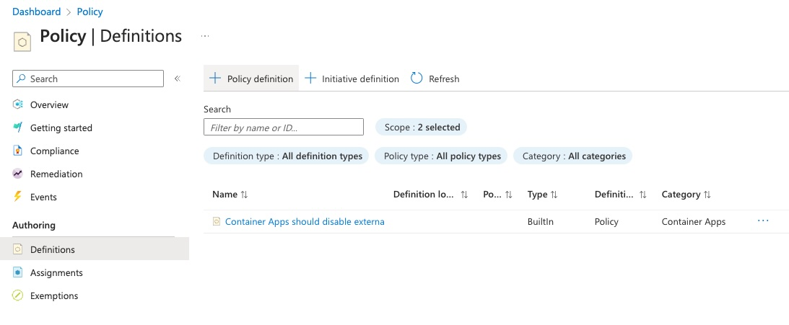
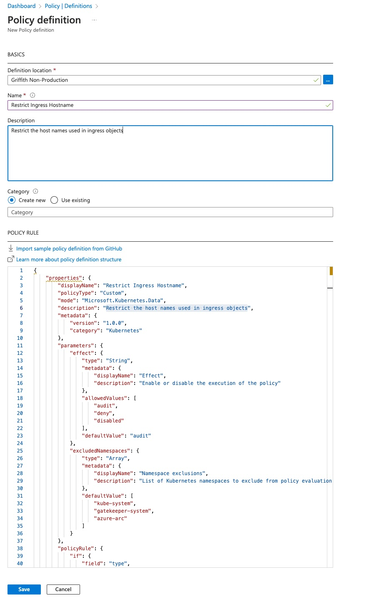
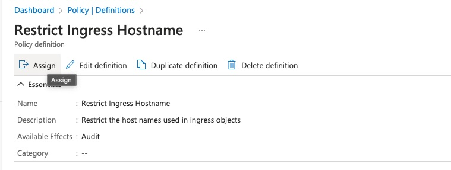
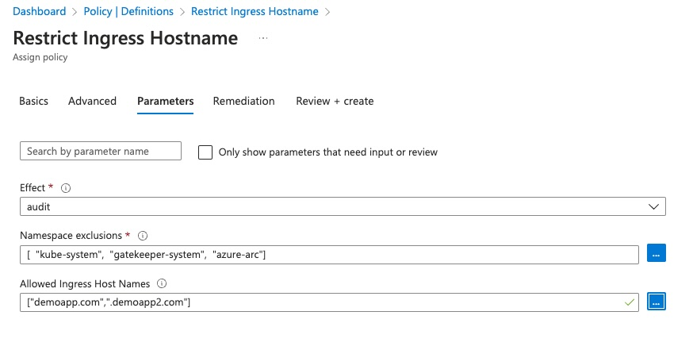
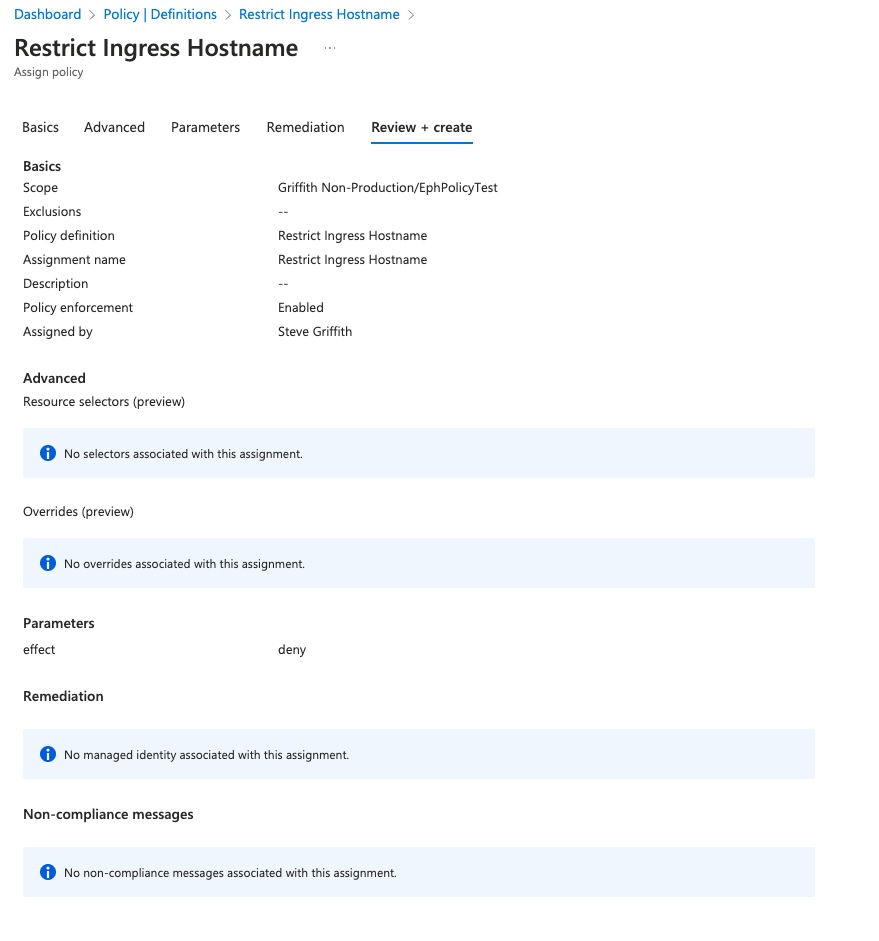

# Gatekeeper - Custom Ingress Policy

## Introduction

In this walkthrough we'll use the [Gatekeeper](https://open-policy-agent.github.io/gatekeeper/website/) project and [AKS Policy](https://learn.microsoft.com/en-us/azure/governance/policy/concepts/policy-for-kubernetes) to create a policy that resticts the host name on a Kubernetes Ingress. The host names used for validation will be provided via parameters on the Azure Policy assignment.

## Cluster Setup

First we'll create an AKS cluster with Azure Policy for AKS enabled.

```bash
# Define variables
RG=PolicyTestRG
LOC=eastus
CLUSTER_NAME=policytest

# Create the resource group
az group create -n $RG -l $LOC

# Create the AKS cluster with Azure Policy enabled
az aks create -g $RG -n $CLUSTER_NAME --enable-addons azure-policy

# Get the cluster credentials
az aks get-credentials -g $RG -n $CLUSTER_NAME
```

## Constraint Template Creation

While the cluster creates we can work on the contraint template. You can read more about constraint templates here, but they are the CRD that provides Gatekeeper the policy details, including the evaluation which is written in [rego](https://www.openpolicyagent.org/docs/latest/policy-language/).

In our example, we'll keep it simple and just restrict the ingress host name to one of the values in an 'allowedhosts' array parameter. The allowedhosts parameter will be set via the constraint definition, or via the policy definition when we create the Azure Policy.

Create a new file named IngressHostnameConstraintTemplate.yaml with the following contents. Or use the doc in [manifests/IngressHostnameConstraintTemplate.yaml](./manifests/IngressHostnameConstraintTemplate.yaml)

```yaml
apiVersion: templates.gatekeeper.sh/v1beta1
kind: ConstraintTemplate
metadata:
  name: k8srestrictingresshostname
  annotations:
    description: Restricts hostname for ingress
spec:
  crd:
    spec:
      names:
        kind: K8sRestrictIngressHostname # this must be the same name as the name on metadata.name (line 4)            
      validation:
        # Schema for the `parameters` field
        openAPIV3Schema:
          properties:
            allowedhosts:
              type: array
              items:
                type: string        
  targets:
    - target: admission.k8s.gatekeeper.sh
      rego: |
        package k8srestrictingresshostname

        violation[{"msg": msg}] {
          host := input.review.object.spec.rules[_].host
          not input_allowed_hosts(host)
          msg := sprintf("invalid ingress host %q", [host])
        }

        input_allowed_hosts(field) {
          endswith(field, input.parameters.allowedhosts[_])
        }
```

## Azure Policy Creation

To create a policy in Azure that uses the above constraint template, we need to base64 encode the above file and pass that into a new policy definition.

```bash
cat ./manifests/IngressHostnameConstraintTemplate.yaml|base64

# Sample Output
YXBpVmVyc2lvbjogdGVtcGxhdGVzLmdhdGVrZWVwZXIuc2gvdjFiZXRhMQpraW5kOiBDb25zdHJhaW50VGVtcGxhdGUKbWV0YWRhdGE6CiAgbmFtZTogazhzcmVzdHJpY3RpbmdyZXNzaG9zdG5hbWUKICBhbm5vdGF0aW9uczoKICAgIGRlc2NyaXB0aW9uOiBSZXN0cmljdHMgaG9zdG5hbWUgZm9yIGluZ3Jlc3MKc3BlYzoKICBjcmQ6CiAgICBzcGVjOgogICAgICBuYW1lczoKICAgICAgICBraW5kOiBLOHNSZXN0cmljdEluZ3Jlc3NIb3N0bmFtZSAjIHRoaXMgbXVzdCBiZSB0aGUgc2FtZSBuYW1lIGFzIHRoZSBuYW1lIG9uIG1ldGFkYXRhLm5hbWUgKGxpbmUgNCkgICAgICAgICAgICAKICAgICAgdmFsaWRhdGlvbjoKICAgICAgICAjIFNjaGVtYSBmb3IgdGhlIGBwYXJhbWV0ZXJzYCBmaWVsZAogICAgICAgIG9wZW5BUElWM1NjaGVtYToKICAgICAgICAgIHByb3BlcnRpZXM6CiAgICAgICAgICAgIGFsbG93ZWRob3N0czoKICAgICAgICAgICAgICB0eXBlOiBhcnJheQogICAgICAgICAgICAgIGl0ZW1zOgogICAgICAgICAgICAgICAgdHlwZTogc3RyaW5nICAgICAgICAKICB0YXJnZXRzOgogICAgLSB0YXJnZXQ6IGFkbWlzc2lvbi5rOHMuZ2F0ZWtlZXBlci5zaAogICAgICByZWdvOiB8CiAgICAgICAgcGFja2FnZSBrOHNyZXN0cmljdGluZ3Jlc3Nob3N0bmFtZQoKICAgICAgICB2aW9sYXRpb25beyJtc2ciOiBtc2d9XSB7CiAgICAgICAgICBob3N0IDo9IGlucHV0LnJldmlldy5vYmplY3Quc3BlYy5ydWxlc1tfXS5ob3N0CiAgICAgICAgICBub3QgaW5wdXRfYWxsb3dlZF9ob3N0cyhob3N0KQogICAgICAgICAgbXNnIDo9IHNwcmludGYoImludmFsaWQgaW5ncmVzcyBob3N0ICVxIiwgW2hvc3RdKQogICAgICAgIH0KCiAgICAgICAgaW5wdXRfYWxsb3dlZF9ob3N0cyhmaWVsZCkgewogICAgICAgICAgZW5kc3dpdGgoZmllbGQsIGlucHV0LnBhcmFtZXRlcnMuYWxsb3dlZGhvc3RzW19dKQogICAgICAgIH0=
```

Create a new file called 'policy-definition.json', and paste the following contenxt, updating the base64 encoded value with your output from above.

```json
{
    "properties": {
        "displayName": "Restrict Ingress Hostname",
        "policyType": "Custom",
        "mode": "Microsoft.Kubernetes.Data",
        "description": "Restrict the host names used in ingress objects",
        "metadata": {
            "version": "1.0.0",
            "category": "Kubernetes"
        },
        "parameters": {
            "effect": {
                "type": "String",
                "metadata": {
                    "displayName": "Effect",
                    "description": "Enable or disable the execution of the policy"
                },
                "allowedValues": [
                    "audit",
                    "deny",
                    "disabled"
                ],
                "defaultValue": "audit"
            },
            "excludedNamespaces": {
                "type": "Array",
                "metadata": {
                    "displayName": "Namespace exclusions",
                    "description": "List of Kubernetes namespaces to exclude from policy evaluation. Providing a value for this parameter is optional."
                },
                "defaultValue": [
                    "kube-system",
                    "gatekeeper-system",
                    "azure-arc"
                ]
            },
            "allowedhosts": {
                "type": "Array",
                "metadata": {
                  "displayName": "Allowed Ingress Host Names",
                  "description": "List of allowed host names that can be used on Ingress objects."
                },
                "defaultValue": []
              }
        },
        "policyRule": {
            "if": {
                "field": "type",
                "in": [
                    "AKS Engine",
                    "Microsoft.Kubernetes/connectedClusters",
                    "Microsoft.ContainerService/managedClusters"
                ]
            },
            "then": {
                "effect": "[parameters('effect')]",
                "details": {
                    "templateInfo": {
                        "sourceType": "Base64Encoded",
                        "content": "YXBpVmVyc2lvbjogdGVtcGxhdGVzLmdhdGVrZWVwZXIuc2gvdjFiZXRhMQpraW5kOiBDb25zdHJhaW50VGVtcGxhdGUKbWV0YWRhdGE6CiAgbmFtZTogazhzcmVzdHJpY3RpbmdyZXNzaG9zdG5hbWUKICBhbm5vdGF0aW9uczoKICAgIGRlc2NyaXB0aW9uOiBSZXN0cmljdHMgaG9zdG5hbWUgZm9yIGluZ3Jlc3MKc3BlYzoKICBjcmQ6CiAgICBzcGVjOgogICAgICBuYW1lczoKICAgICAgICBraW5kOiBLOHNSZXN0cmljdEluZ3Jlc3NIb3N0bmFtZSAjIHRoaXMgbXVzdCBiZSB0aGUgc2FtZSBuYW1lIGFzIHRoZSBuYW1lIG9uIG1ldGFkYXRhLm5hbWUgKGxpbmUgNCkgICAgICAgICAgICAKICAgICAgdmFsaWRhdGlvbjoKICAgICAgICAjIFNjaGVtYSBmb3IgdGhlIGBwYXJhbWV0ZXJzYCBmaWVsZAogICAgICAgIG9wZW5BUElWM1NjaGVtYToKICAgICAgICAgIHByb3BlcnRpZXM6CiAgICAgICAgICAgIGFsbG93ZWRob3N0czoKICAgICAgICAgICAgICB0eXBlOiBhcnJheQogICAgICAgICAgICAgIGl0ZW1zOgogICAgICAgICAgICAgICAgdHlwZTogc3RyaW5nICAgICAgICAKICB0YXJnZXRzOgogICAgLSB0YXJnZXQ6IGFkbWlzc2lvbi5rOHMuZ2F0ZWtlZXBlci5zaAogICAgICByZWdvOiB8CiAgICAgICAgcGFja2FnZSBrOHNyZXN0cmljdGluZ3Jlc3Nob3N0bmFtZQoKICAgICAgICB2aW9sYXRpb25beyJtc2ciOiBtc2d9XSB7CiAgICAgICAgICBob3N0IDo9IGlucHV0LnJldmlldy5vYmplY3Quc3BlYy5ydWxlc1tfXS5ob3N0CiAgICAgICAgICBub3QgaW5wdXRfYWxsb3dlZF9ob3N0cyhob3N0KQogICAgICAgICAgbXNnIDo9IHNwcmludGYoImludmFsaWQgaW5ncmVzcyBob3N0ICVxIiwgW2hvc3RdKQogICAgICAgIH0KCiAgICAgICAgaW5wdXRfYWxsb3dlZF9ob3N0cyhmaWVsZCkgewogICAgICAgICAgZW5kc3dpdGgoZmllbGQsIGlucHV0LnBhcmFtZXRlcnMuYWxsb3dlZGhvc3RzW19dKQogICAgICAgIH0="
                    },
                    "excludedNamespaces": "[parameters('excludedNamespaces')]",
                    "values": {
                        "allowedhosts": "[parameters('allowedhosts')]"
                    },
                    "apiGroups": [
                        "extensions", 
                        "networking.k8s.io"
                    ],
                    "kinds": [
                        "Ingress"
                    ]
                }
            }
        }
    }
}
```

Now in the Azure portal, go to Azure Policy and create a new policy using the tempalate json from above.

1. In Azure Policy, open 'Definitions' and click '+ Policy Definition'

    

2. Fill in the details and paste in the contents from your policy-definition.json and click 'Save'

    

3. Once the policy is created you will be navigated to the policy where you can select 'Assign'

    

4. Fill in the details in all the tabs, including the scope and optionally adjust the 'Effect' option to drive if the policy will audit or block

    

5. After you've reviewed the policy, click 'Create'

    

## Test the policy

It can take 30 minutes or more for the policy to apply to the selected resource. You can accelerate the process with the following. The following assumes you set the policy scope to the resource group of the cluster we created above.

```bash
az policy state trigger-scan --resource-group $RG
```

While the above command runs, you can watch the cluster for constraint templates and constraints to be automatically created by Azure Policy.

```bash
kubectl get constrainttemplates|grep k8srestrictingresshostname

# Sample Output
k8srestrictingresshostname         49m

# Check the Constraint 
# This assume you have the jq command, but you can remove it
kubectl get constraint -o=jsonpath='{.items[?(@.kind=="K8sRestrictIngressHostname")]}'|jq
```

If you apply this on a cluster that already has ingress instances that are not compliant, you will see them eventually in the portal, but can also look a the constraint itself.

```bash
kubectl get constraint -o=jsonpath='{.items[?(@.kind=="K8sRestrictIngressHostname")].status.violations}'|jq

# Sample Output
[
  {
    "enforcementAction": "dryrun",
    "group": "networking.k8s.io",
    "kind": "Ingress",
    "message": "invalid ingress host \"myapp.com\"",
    "name": "ingress-policy-fail",
    "namespace": "default",
    "version": "v1"
  }
]
```

## Test the policy

Now lets try to create a new ingress that does not match the policy.

```bash
kubectl apply -f manifests/sample-ingress.yaml

ingress.networking.k8s.io/ingress-policy-pass created
Error from server (Forbidden): error when creating "manifests/sample-ingress.yaml": admission webhook "validation.gatekeeper.sh" denied the request: [azurepolicy-k8srestrictingresshostname-ada01c8bf99df9ddb0a8] invalid ingress host "myapp.com"
```

## Conclusion

You should now understand the process for creating a basic custom ConstraintTemplate and Azure Policy using that template. 