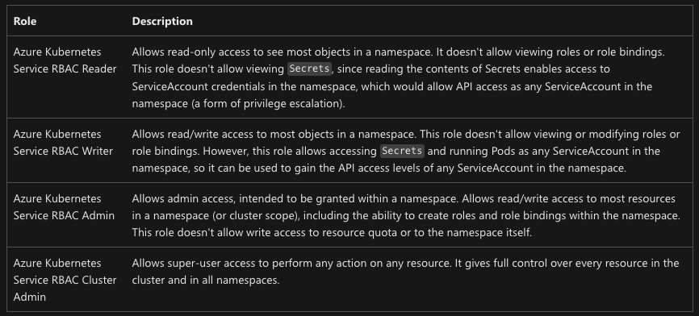

# AKS User Minimum Roles

The following provides guidance on the minimum roles needed by an AKS user to get their credentials and interact with a namespace we'll create called 'sample-app'.

## Setup

First we'll create an AKS cluster with Azure AD integrated authentication and Azure AD RBAC enabled. We will leave 'local accounts' enabled for simplicity, but that option would typically be disabled and you would provide AKS an admin user Group ID for cluster admin access.

### Cluster Creation

```bash
SUBSCRIPTION_ID=''
RG=EphAADDemo
LOC=eastus
CLUSTER_NAME=aad-demo

# Create the resource group
az group create -n $RG -l $LOC

# Create the cluster
az aks create \
-g $RG \
-n $CLUSTER_NAME \
--enable-aad \
--enable-azure-rbac

# Get the admin credential so we can create the namespace
az aks get-credentials -g $RG -n $CLUSTER_NAME --admin

# Create the namespace
kubectl create ns sample-app

# Deploy an app
kubectl create deployment nginx --image=nginx --namespace sample-app

# Expose the deployment as a Kubernetes service
kubectl expose deployment nginx --port 8080 --target-port 80 --namespace sample-app

# Create a secret
kubectl create secret generic sample-secret --from-literal=message=Hello -n sample-app

# Check out the created resources
kubectl get all -n sample-app
```

### Create the test service principal

We'll create a service principal with no rights to use as our user account.

```bash
# Create the sample app user
az ad sp create-for-rbac --skip-assignment -o json > sample-app-team-user.json

# Get the App ID and Password into some variables we can use
APP_ID=$(cat sample-app-team-user.json|jq -r .appId)
APP_SECRET=$(cat sample-app-team-user.json|jq -r .password)
TENANT=$(cat sample-app-team-user.json|jq -r .tenant)
```

### Allow user to call 'az aks get-credentials'

We need to be able to get the cluster access details, which will live in the 'kubeconfig' file and include the cluster FQDN and API access certificates. We got the admin credentials above, but we dont want to use those. We'll use the admin credential again later, so dont delete it just yet.  

```bash
# First we need the resource ID for the cluster
CLUSTER_RESOURCE_ID=$(az aks show -g $RG -n $CLUSTER_NAME -o tsv --query id)

# Take a look at the role definition we'll apply
# In particular, look at the enabled actions
az role definition list --name "Azure Kubernetes Service Cluster User Role" -o yaml

# Give our user the role
az role assignment create \
--assignee $APP_ID \
--scope $CLUSTER_RESOURCE_ID \
--role "Azure Kubernetes Service Cluster User Role"

# Login as the assigned user
az login --service-principal -u $APP_ID -p $APP_SECRET --tenant $TENANT

# Check your basic access
# You should be able to list AKS clusters only
az aks list

# You should not be able to see any resource groups, vms, etc
az group list
az vm list

# Now try to get AKS cluster credentials
az aks get-credentials -g $RG -n $CLUSTER_NAME
```

This is where things get a little weird in our scenario. We're signing in as a service account. In the next step we'll try to use the kubernetes cli (kubectl), and for normal human users you would get a device login prompt, which will take you to your normal Azure AD multi-factor auth flow. However, we're using a service principal so we need to take a few extra steps and use the [kubelogin](https://azure.github.io/kubelogin/quick-start.html) project to sign in.

You'll likely need to install kubelogin. You can find the installation steps here: [Installation](https://azure.github.io/kubelogin/install.html)

```bash
# Convert the kube config file with kubelogin
kubelogin convert-kubeconfig -l azurecli
```

### Try to access kubernetes objects

When you try to access any kubernetes resources you'll find your service account has no access. We'll just check for namespace list access, but you'll see the same across any resource as we have not done anything yet with Kubernetes level RBAC.

```bash
kubectl get ns

# Sample Error Message
Error from server (Forbidden): namespaces is forbidden: User "xxxxxxxx-xxxx-xxxx-xxxx-xxxxxxxx" cannot list resource "namespaces" in API group "" at the cluster scope: User does not have access to the resource in Azure. Update role assignment to allow access.
```

### Enable sample-app namespace access with Azure AD RBAC

We'll need to jump out of our service principal login back to our normal user account, so we can create some new role assignments.

```bash
# Login to Azure
az login

# If needed, set your subscription
az account set -s <SUBSCRIPTION ID>
```

Lets assign read-only access to the 'sample-app' namespace alone for our service principal.

```bash
az role assignment create --role "Azure Kubernetes Service RBAC Reader" --assignee $APP_ID --scope $CLUSTER_RESOURCE_ID/namespaces/sample-app

# Log back in as the service principal
az login --service-principal -u $APP_ID -p $APP_SECRET --tenant $TENANT

# Try to access resources in the cluster
# This command will be forbidden
kubectl get ns

# Try a few other commands, and you'll see them fail.

# Now try to read resources from the permitted namespace
# This command will succeed
kubectl get all -n sample-app

# We can also view the pod logs
kubectl logs -l app=nginx -n sample-app

# Secrets and roles have special treatment, so they are not visible. Try to look at secrets and roles
# These will fail
kubectl get secrets -n sample-app
kubectl get roles

# We only granted read-only, so lets try to create something
# This will fail
kubectl run nginx-fail --image=nginx -n sample-app

```

Now lets increase the scope beyond our namespace and give the service principal read access across the whole cluster. You'll have to log back in with your normal user account to grant the role.

```bash
# Again, log back into your other account
az login

# Delete the previous role assignment
az role assignment delete --role "Azure Kubernetes Service RBAC Reader" --assignee $APP_ID --scope $CLUSTER_RESOURCE_ID/namespaces/sample-app

# Create the new role assignment
az role assignment create --role "Azure Kubernetes Service RBAC Reader" --assignee $APP_ID --scope $CLUSTER_RESOURCE_ID

# Log back in as your service principal account
az login --service-principal -u $APP_ID -p $APP_SECRET --tenant $TENANT

# Now run some commands to see if you can read the whole cluster
kubectl get all -A
kubectl get pods -A

# Now try to delete something, like our sample-app namespace
# This command will be forbidden
kubectl delete ns sample-app

# Again, as mentioned with the namespace scope, secrets and roles are special. Try to view secrets and roles
# These will fail
kubectl get secrets -A
kubectl get roles
```

### Explore the Out of the Box Roles

AKS provides 4 out of the box roles for Azure RBAC in Kubernetes. You can read more [here](https://learn.microsoft.com/en-us/azure/aks/manage-azure-rbac#create-role-assignments-for-users-to-access-the-cluster)



## Create a custom role definition

If we want to expand the role to include secrets reader access then we'll need a custom role.

```bash
# Make sure you're logged in as your normal user account

# Create the role definition file
cat << EOF > secrets-aad-role.json
{
    "Name": "AKS Sample App Secrets Reader",
    "Description": "Lets you view all Secrets in the sample-app namespace.",
    "Actions": [],
    "NotActions": [],
    "DataActions": [
        "Microsoft.ContainerService/managedClusters/secrets/read"
    ],
    "NotDataActions": [],
    "assignableScopes": [
        "$CLUSTER_RESOURCE_ID/namespaces/sample-app"
    ]
}
EOF

# Create the role definition in Azure
az role definition create --role-definition @secrets-aad-role.json

#####################################################################
#
# NOTE!!! Role propegation may take a couple minutes, so if this fails
# wait a minute and try again.
#
#####################################################################

# Assign the role
az role assignment create --role "AKS Sample App Secrets Reader" --assignee $APP_ID --scope $CLUSTER_RESOURCE_ID/namespaces/sample-app
```

Now that the custom role has been created and applied, we can log back in as our service principal and test it's ability to view secrets.

```bash
# Log in as the service principal
az login --service-principal -u $APP_ID -p $APP_SECRET --tenant $TENANT

# Look at the secret created previously
kubectl get secrets -n sample-app

# Get the value out of the secret...keeping mind that secrets are base64 encoded
kubectl get secret sample-secret -n sample-app -o jsonpath='{.data.message}'|base64 --decode
```

## Conclusion

This walk-through demonstrated setting up an AKS cluster with Azure AD authenitication and Azure AD RBAC enabled, and then how to use Azure built in roles, as well as custom roles, to interact with your cluster.