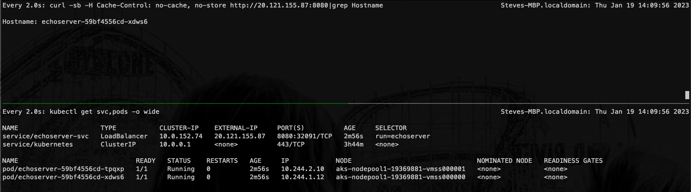
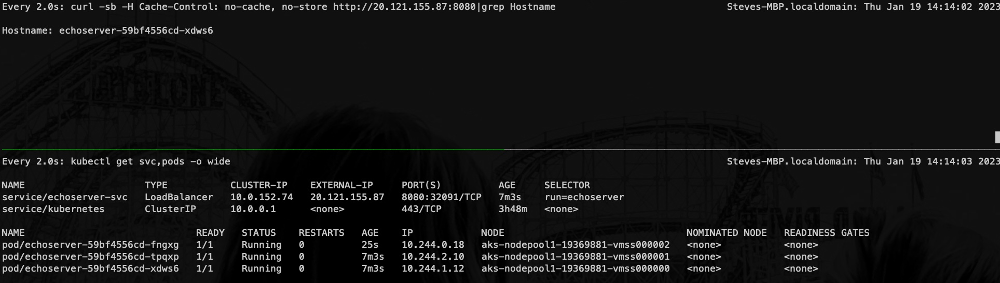
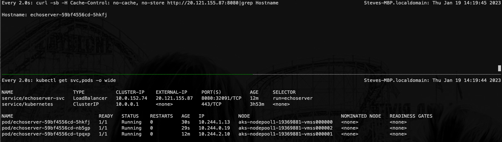

# AKS Sticky SLB Test Setup

## Cluster Creation

```bash
# Set Env Args
RG=EphSLBTest
LOC=eastus
CLUSTER_NAME=slbtest
NAMESPACE=default

# Create the resource group
az group create -n $RG -l $LOC

# Create the cluster
az aks create -n $CLUSTER_NAME -g $RG 

# Get Cluster Credentials
az aks get-credentials -n $CLUSTER_NAME -g $RG --admin
```

## Deploy the workloads

```bash
# Deploy the echo server pods
kubectl apply -f manifests/echoserver.yaml
```

## Monitor

In one terminal we'll watch the pods as we scale up and down and in the other we'll run a curl command against the echoserver.

> **Note:** We'll start with 2 pods across three nodes, so we can see that the stickiness maintains on scale up. For simplicity we will not go above 3 pods for this test, as kubernetes will evenly distribute pods across the three nodes (i.e. 3 pods on 3 nodes will lead to one pod per node)

Terminal 1:
```bash
watch kubectl get pods -o wide

# Sample Output
Every 2.0s: kubectl get pods -o wide                                                                                         Steves-MBP.localdomain: Thu Jan 19 11:46:26 2023

NAME                          READY   STATUS    RESTARTS   AGE   IP           NODE                                NOMINATED NODE   READINESS GATES
echoserver-59bf4556cd-cdq24   1/1     Running   0          7s    10.244.1.8   aks-nodepool1-19369881-vmss000000   <none>           <none>
echoserver-59bf4556cd-ghvms   1/1     Running   0          7s    10.244.2.8   aks-nodepool1-19369881-vmss000001   <none>           <none>
```

Terminal 2:
```bash
watch curl -sb -H 'Cache-Control: no-cache, no-store' http://20.237.48.44:8080\|grep Hostname

# Sample Output
Every 2.0s: curl -sb -H Cache-Control: no-cache, no-store http://20.237.48.44:8080|grep Hostname                             Steves-MBP.localdomain: Thu Jan 19 11:43:40 2023

Hostname: echoserver-59bf4556cd-xcppv
```

## Test scaling and watch the pod count and host name

```bash
# Scale the deployment up
kubectl scale deploy echoserver --replicas=3

## Result: The client traffic remains pinned to the current pod (i.e. Hostname doesnt change)

# Scale the deployment down
kubectl scale deploy echoserver --replicas=1

## Result: Unless your current pod happens to be the one that remains online, you will see your traffic shift to another pod (i.e. Hostname will change)

# Scale the deployment back up
kubectl scale deploy echoserver --replicas=3

## Result: If you're traffic moved from one backend pod to another, you will see your traffic shift back to the original pod.
```

## What to watch

### Initial deployment and scale up
What you'll see, after the initial deployment, is that the traffic from your client will hit one pod on one node and then it will stay with that pod/node for all subsequent requests. When you scale up, you'll see the traffic will continue to remain with the same pod/node, further demonstrating the stickiness of the traffic. 

In the below image we just deployed the app with two instances and are sending our initial requests. The traffic is sticky to the pod named 'echoserver-59bf4556cd-xdws6' which is on node 0 (aks-nodepool1-19369881-vmss000000).



In the below, we've run the scale up operation and now we have 3 pods across the three nodes. However, as you can see, the traffic has remained with the same pod (echoserver-59bf4556cd-xdws6).



### Scale down
Once you scale down, assuming the pod you're currently reaching is part of the scale down termination, you'll see the client traffic transition for to a new pod (i.e. the hostname value in the response message will change as the pod changes). This makes sense because the pod you were hitting was part of the scale down and was terminated, so the traffic needs to flow to a new pod, which may or may not be on a different node.

In the below, you can see that, after scaling down to 1 pod, the pod we were actively reaching was terminated and the only remaining pod is echoserver-59bf4556cd-tpqxp on node 1 (aks-nodepool1-19369881-vmss000001). 


### Scale back up
When you scale back up, with ClientIP as the session affinity, you'd expect that the traffic would remain with the pod/node you're client is currently hitting. What you will actually see, as a new pod comes online on the node your client initially was hitting at the begining of the test, is that the client traffic will be transitioned back to the original target node and the pod on that node. From that point forward you will once again be sticky to that node...at least until the next scale operation.

In the below, after we've scaled back up to 3 pods, you can see that the traffic has transitioned back to the pod on node 0, which happens to be pod echoserver-59bf4556cd-5hkfj.



### Video 
You can see a video of this demo here:
[demo](https://griffcontent.blob.core.windows.net/public/stickyscaledemo.mp4)