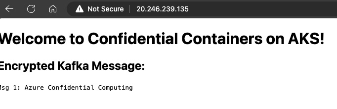

# AKS Confidential Containers

The following walk through demonstrates the setup for an AKS cluster with Confidential Containers, along with a kafka demo app.

## Feature Registration

This example relies on enabling the Kata Confidential Containers feature, which is currently in preview as well as enabling the aks-preview and confcom Azure CLI extensions.

>**NOTE:** The confcom extension does not fully work on MacOC, so Mac users may need to run this all in cloud shell. I'd recommend choosing one terminal environment and sticking with it for simplicity.

```bash
# Add or update the aks-preview cli extension
az extension add --name aks-preview
# or if you already have aks-preview installed
az extension update --name aks-preview

# Add or update the confcom cli extension
az extension add --name confcom
# of i you already have confcom installed
az extension update --name confcom

# Register for the Kata CC preview feature
az feature register --namespace "Microsoft.ContainerService" --name "KataCcIsolationPreview"
# To check status on the preview registration
az feature show --namespace "Microsoft.ContainerService" --name "KataCcIsolationPreview"

# Once registration completes you need to re-register the Microsoft.ContainerService provider
az provider register --namespace "Microsoft.ContainerService"
```


## Cluster Setup

Now we'll set up the AKS cluster. The demo will use Workload Identity, so we'll need the OIDC Issuer and Workload Identity features enabled.

### Create the Cluster

We'll create a cluster with a single nodepool, however in the real world we would likely set up a separate nodepool.

```bash
# Set intial variables
export SUBSCRIPTION="$(az account show --query id --output tsv)" 
export RESOURCE_GROUP="EphKataTest" 
export LOCATION="eastus"  
export CLUSTER_NAME="katatest" 

# Create the resource group
az group create -n $RESOURCE_GROUP -l $LOCATION

# Create the AKS cluster
az aks create -g $RESOURCE_GROUP \
-n $CLUSTER_NAME \
--os-sku AzureLinux \
--node-vm-size Standard_DC4as_cc_v5 \
--enable-oidc-issuer \
--enable-workload-identity \
--workload-runtime KataCcIsolation

# Get the cluster credentials
az aks get-credentials --name "${CLUSTER_NAME}" --resource-group "${RESOURCE_GROUP}" --overwrite-existing
```

### Create and Federate the Workload Identity

```bash
# Setup the workload identity variables
export SERVICE_ACCOUNT_NAMESPACE="kafka"  
export SERVICE_ACCOUNT_NAME="workload-identity-sa"  
export USER_ASSIGNED_IDENTITY_NAME="myIdentity"  
export FEDERATED_IDENTITY_CREDENTIAL_NAME="myFedIdentity"  

# Get the OIDC Issure URI
export AKS_OIDC_ISSUER="$(az aks show -n "${CLUSTER_NAME}" -g "${RESOURCE_GROUP}" --query "oidcIssuerProfile.issuerUrl" -otsv)" 

# Create the managed identity
az identity create --name "${USER_ASSIGNED_IDENTITY_NAME}" --resource-group "${RESOURCE_GROUP}" --location "${LOCATION}" --subscription "${SUBSCRIPTION}" 

# Get the managed identity client ID for later
export USER_ASSIGNED_CLIENT_ID="$(az identity show --resource-group "${RESOURCE_GROUP}" --name "${USER_ASSIGNED_IDENTITY_NAME}" --query 'clientId' -otsv)" 

# Get the managed identity Azure Resource ID
export MANAGED_IDENTITY="$(az identity show --resource-group "${RESOURCE_GROUP}" --name "${USER_ASSIGNED_IDENTITY_NAME}" --query 'id' -o tsv)"

# We'll deploy everything into a kafka namespace, so we'll create that now as a place to put our Service Account
kubectl create namespace kafka  

# Create the service account
cat <<EOF | kubectl apply -f -
apiVersion: v1
kind: ServiceAccount
metadata:
  annotations:
    azure.workload.identity/client-id: ${USER_ASSIGNED_CLIENT_ID}
  labels:
    azure.workload.identity/use: "true"
  name: ${SERVICE_ACCOUNT_NAME} 
  namespace: ${SERVICE_ACCOUNT_NAMESPACE} 
EOF

# Federate the Service Account to the Managed Identity
az identity federated-credential create \
--name ${FEDERATED_IDENTITY_CREDENTIAL_NAME} \
--identity-name ${USER_ASSIGNED_IDENTITY_NAME} \
--resource-group ${RESOURCE_GROUP} \
--issuer ${AKS_OIDC_ISSUER} \
--subject system:serviceaccount:${SERVICE_ACCOUNT_NAMESPACE}:${SERVICE_ACCOUNT_NAME} 
```


### Create the Key Vault 

```bash
# Set key vault variables
KEY_VAULT_NAME=griffkatakv3
CURRENT_USER=$(az ad signed-in-user show --query userPrincipalName -o tsv)

# Create a key vault
az keyvault create --name $KEY_VAULT_NAME --resource-group $RESOURCE_GROUP --location $LOCATION --sku premium

# Get the Key Vault Azure Resource ID
AKV_SCOPE=$(az keyvault show -g $RESOURCE_GROUP --name $KEY_VAULT_NAME --query id --output tsv)

# Assign the current logged in user the needed roles
az role assignment create --role "Key Vault Crypto Officer" --assignee $CURRENT_USER --scope $AKV_SCOPE
az role assignment create --role "Key Vault Crypto User" --assignee $CURRENT_USER --scope $AKV_SCOPE

# Assign the managed identity key release rights, needed by the application
az keyvault set-policy --name $KEY_VAULT_NAME --key-permissions release --spn "${USER_ASSIGNED_CLIENT_ID}"
```

### Create Kafka

```bash
# Deploy the Kafka Operator
kubectl create -f 'https://strimzi.io/install/latest?namespace=kafka' -n kafka
# Deploy a Kafka instance
kubectl apply -f https://strimzi.io/examples/latest/kafka/kafka-persistent-single.yaml -n kafka 
```

### Set the Key Vault FQDN in the Consumer

Edit the consumer.yaml file in /manifests to set the SkrClientAKVEndpoint environment variable to the FQDN of your key vaule (i.e. yourvaultname.vault.azure.net)

### Take your workload measurement for confidential containers

The following will use confcom to take a measurement of the workload, which will be base64 encoded, we'll get the sha and then we'll remove spaces.

```bash
# Move to the manifests directory
cd manifests
# Using az confcom, get the workload measurement
export WORKLOAD_MEASUREMENT=$(az confcom katapolicygen -y consumer.yaml --print-policy | base64 --decode | sha256sum | cut -d' ' -f1)
```

### Generate the key files using the setup script

The following will run the setup-key script which will use the Workload Measurement to create a policy used to create a key in key vault. This will ensure that attestation will be needed to retrieve the key value. The script will also download the key files for use.

```bash
# Export the Attestation Endpoint
export MAA_ENDPOINT="sharedeus.eus.attest.azure.net"
# Run the setup-key script with the proper parameters
bash setup-key.sh "kafka-encryption-demo" $KEY_VAULT_NAME.vault.azure.net
```

### Update and deploy the application

Now that you have the key, you can take the value from the public key file, which will likely be named 'kafka-encryption-demo-pub.pem', if you ran the exact command above. Copy the complete contents of that public key file and paste them in the 'producer.yaml' file as the PUBKEY value.

Now we can deploy the application.

```bash
# Deploy the kafka producer
kubectl apply -f producer.yaml
# Deploy the kafka consumer
kubectl apply -f consumer.yaml

# Watch the deployment
watch kubectl get svc,pods -n kafka

# Once all pods are running, check the logs for the consumer
kubectl logs kafka-golang-consumer -c skr -n kafka
```

In the skr container logs you should see the application successfully make a call(HTTP 200) to /release/keys, like the following:

```bash
[GIN] 2023/11/29 - 19:44:41 | 200 |    1.2010196s |       127.0.0.1 | POST     "/key/release"
```

If you did not, you need to go back and check your steps. If you did get a 200, you can check the application logs and also check the http endpoint via curl your your browser.

```bash
kubectl logs -f kafka-golang-consumer -c kafka-golang-consumer -n kafka

# Sample Output
023/11/29 20:23:53 Message received: value=Msg 7: Azure Confidential Computing, partition=0, offset=1176
2023/11/29 20:23:53 Message received: value=Msg 9: Azure Confidential Computing, partition=0, offset=1177
2023/11/29 20:23:53 Message received: value=Msg 11: Azure Confidential Computing, partition=0, offset=1178

# Now you can get the public IP and check out the web app
kubectl get svc consumer -o jsonpath='{.status.loadBalancer.ingress[0].ip}'
```

<BR>




## Conclusion

In this walkthrough we set up a basic AKS cluster with Workload Identity and Confidential Containers enabled. We also used the confcom Azure CLI plugin to take an application deployment and generate a Workload Measurement, which can be used for confidential compute remote attestation by a relying party, which in this sample's case is Azure Key Vault. We then created a key in Azure Key Vault with a policy for attestation. Finally, we updated our producer manifest to use the public key we generated and started the producer, which started creating encrypted messages in kafka. Finally, the consumer started and was able to call Key Vault successfully, with attestation, to get the key to decrypt the messages encrypted by the producer.

