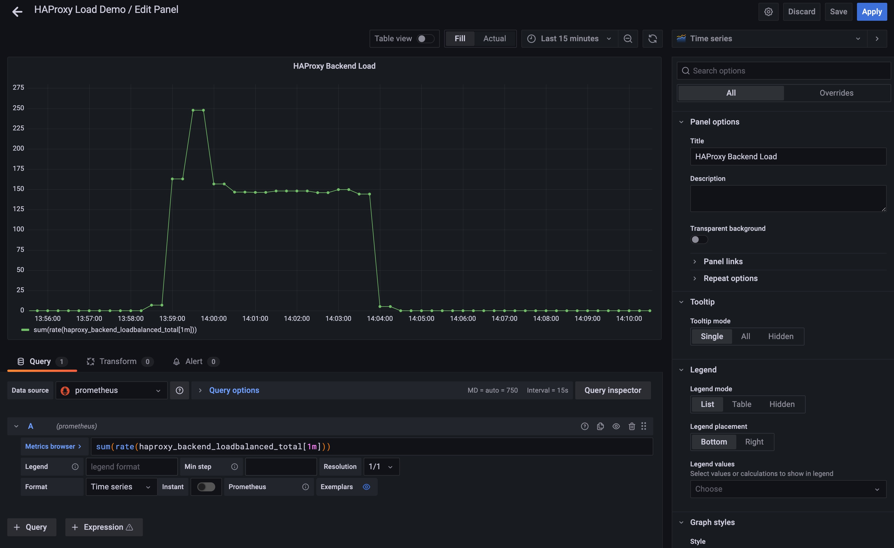
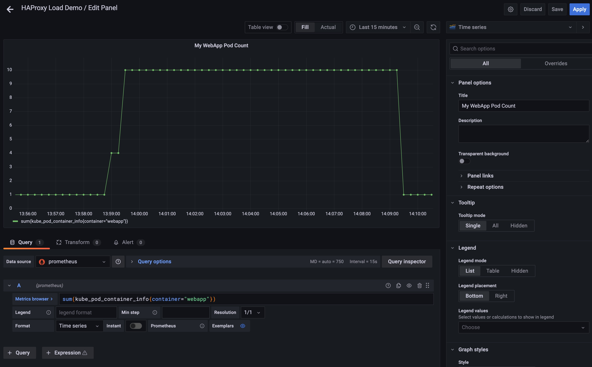
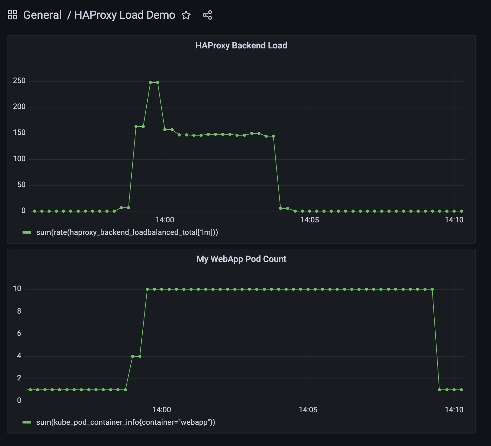

# Auto-scaling App Using Nginx Ingress Metrics and Prometheus

In this walkthrough we'll set up an AKS cluster running Prometheus and Nginx Ingress, and then show how you can use nginx ingress metrics to autoscale the application.

## Cluster Setup

First lets create the cluster. We'll go with a very basic default config cluster.

```bash
RG=EphHTTPAutoScale
LOC=eastus
CLUSTER_NAME=httpscalelab

# Create the resource group
az group create -n $RG -l $LOC

# Create the AKS cluster
az aks create -g $RG -n $CLUSTER_NAME 

az aks get-credentials -g $RG -n $CLUSTER_NAME

kubectl create ns monitoring
```

## Kube Prometheus Install

We're going to install Kube Prometheus, because it has all of the components we need (i.e. Prometheus, ServiceMonitor) but it also has Grafana an several Kubernetes dashboards we may like to check out. By default kube-prometheus uses the namespace 'monitoring', so to keep things simple we'll just use that namespace for everything.

>*NOTE:* Kube Prometheus is installed from manifests in the upstream project git repo, so you'll need to clone that. The documentation lists version [compatibility](https://github.com/prometheus-operator/kube-prometheus#kubernetes-compatibility-matrix), so you'll want to git checkout the right branch for your kubenetes version before running the install. 

```bash
# Move to your prefered git repo cloning directory. For me thats ~/github.com
cd ~/github.com
git clone https://github.com/prometheus-operator/kube-prometheus.git
cd kube-prometheus

# Checkout the branch that matches your kubernetes version, as noted above
# I'm running Kubernetes 1.21.9 so I can see in the compatibility list
# that I can use release-0.9....so lets check that out
git checkout release-0.9

# Now to install
# First the namespace and CRDs which are in the setup folder
cd manifests/setup
kubectl apply -f .
# Now jump back up to the manifests folder to install the rest
cd ..
kubectl apply -f .

# Wait for the pods to come online
watch kubectl get svc,pods -n monitoring   

# Test Access
# Run the following and then open your browser to http://localhost:8080
kubectl port-forward service/prometheus-k8s -n monitoring 9090:9090

```

## Keda Install

Nothing specialy about our Keda setup. Just the out of the box setup, but we will target our 'monitoring' namespace.

```bash
helm repo add kedacore https://kedacore.github.io/charts
helm repo update
helm install keda kedacore/keda --namespace monitoring
```

## HAProxy Ingress

We'll install HAProxy Ingress into our 'monitoring' namespace. We'll also enable the following:

* Service Type: We'll use LoadBalancer, since we want public internet access to the services we'll expose. You could alternatively use the default 'NodePort' option, or even use 'LoadBalancer' and add an annotation for 'internal' if you want an internal load balancer.
* Auto-Scaling: We want our HAProxy controllers to autoscale if needed. Default will only scale them once they hit 80% CPU utilization, which we probably wont hit in our testing, but you may in your testing.
* ServiceMonitor: ServiceMonitor is a CRD included with the Prometheus Operator which allows you to define a metric scraping target for Prometheus. HAProxy allows you to have it deploy the ServiceMonitor config for you, which will then let Prometheus scrape HAProxy metrics

```bash
helm repo add haproxy-ingress https://haproxy-ingress.github.io/charts
helm repo update

helm install haproxy-ingress haproxytech/kubernetes-ingress \
--namespace monitoring \
--set controller.service.type=LoadBalancer \
--set controller.autoscaling.enabled=true \
--set controller.serviceMonitor.enabled=true

# In one terminal
kubectl port-forward service/prometheus-k8s -n monitoring 9090:9090

# In another terminal test metric scraping
curl 'localhost:9090/api/v1/query?query=haproxy_process_build_info'
```

## Sample App Install

Our sample app is a simple deployment with 3 replicas running the nginx web server (not nginx ingress). We have in ingress definition that will tell HAProxy where to route the web app traffic.

```bash
kubectl apply -f webapp.yaml -n monitoring
kubectl apply -f ingress.yaml -n monitoring

watch kubectl get svc,pods -n monitoring

# Open your browser and navigate to http://<nginx-ingress public ip>/myapp
# or you can use the following to test from the terminal
INGRESS_PUB_IP=$(kubectl get svc haproxy-ingress-kubernetes-ingress -o=jsonpath='{.status.loadBalancer.ingress[0].ip}')
curl http://$INGRESS_PUB_IP/myapp
```

## Deploy the Keda ScaledObject Configuration

Now, finally, we can deploy our ScaledObject configuration, which will tell Keda what scaler to use, and the parameters for that scaler. In our case, this includes the target serverAddress (Note that we included the port 9090. This may vary depending on whether you ran Kube-Prometheus or just the Prometheus Operator directly). This also includes the PromQL query we're using. You can play with this query to better align to your own needs. This will also vary if you're using another ingress controller, other than HAProxy.

```yaml
apiVersion: keda.sh/v1alpha1
kind: ScaledObject
metadata:
  name: prometheus-scaledobject
  labels:
    deploymentName: myapp-http
spec:
  scaleTargetRef:
    name: webapp
  pollingInterval: 5
  cooldownPeriod:  10
  minReplicaCount: 1
  maxReplicaCount: 10
  triggers:
  - type: prometheus
    metadata:
      serverAddress: http://prometheus-k8s.monitoring.svc.cluster.local:9090
      metricName: process_connections
      threshold: '10'
      query: sum(rate(haproxy_backend_loadbalanced_total[1m]))
```

Appy the ScaleObject manifest to the cluster.

```bash
kubectl apply -f keda-prom.yml -n monitoring
```

After a few minutes you should see the number of webapp pods drop from 3, which was set in the deployment, to 1 which is the min pods for the scaled object.

Run some load against the site and watch for the pods to scale. I used [hey](https://github.com/rakyll/hey). 

```bash
# In one terminal window
hey -z 5m -c 20 --disable-keepalive http://<Insert you Ingress Public IP>/myapp

# In another terminal window
watch kubectl get pods -n httpscaledemo -n monitoring
```

## Sweet Dashboards in Grafana

If you want to watch this in grafana you can port-forward to the grafana service. 

```bash
kubectl port-forward service/grafana -n monitoring 3000:3000
```

Browse to the Grafana dashboard at http://localhost:3000

Default user id is 'admin' and default password is 'admin'.

Now you can add a new dashboard, select 'prometheus' as the data source and put in the queries you want to visualize. Here are some screen shots of my setup.

### HAProxy View



### Web App Pod Count View



### Final Dashboard View

