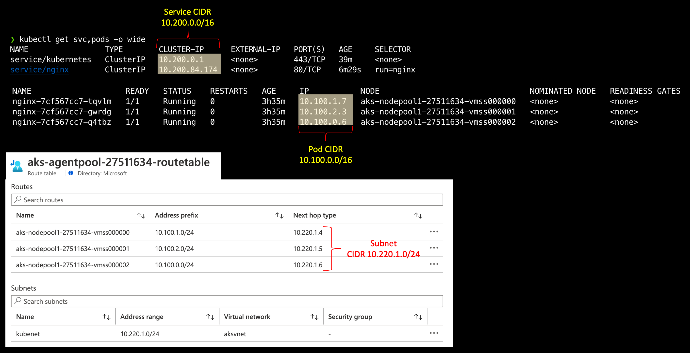
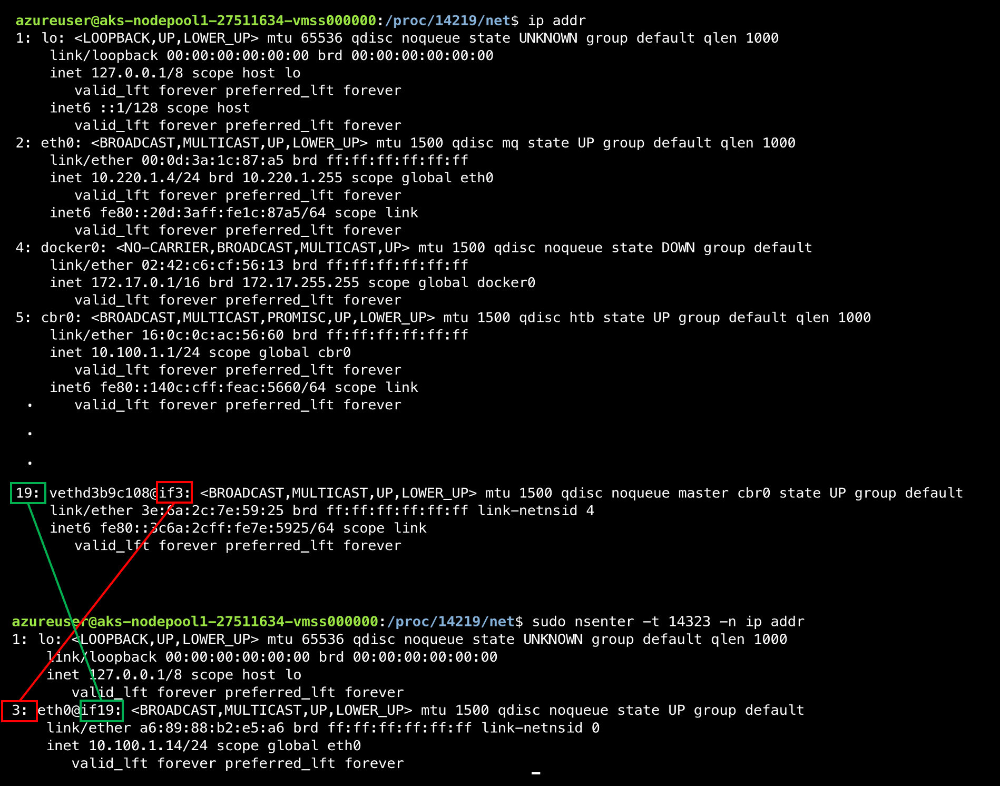
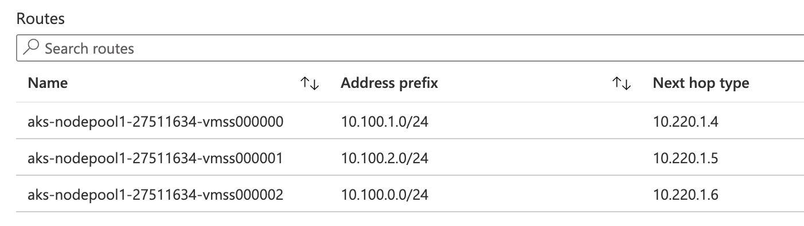
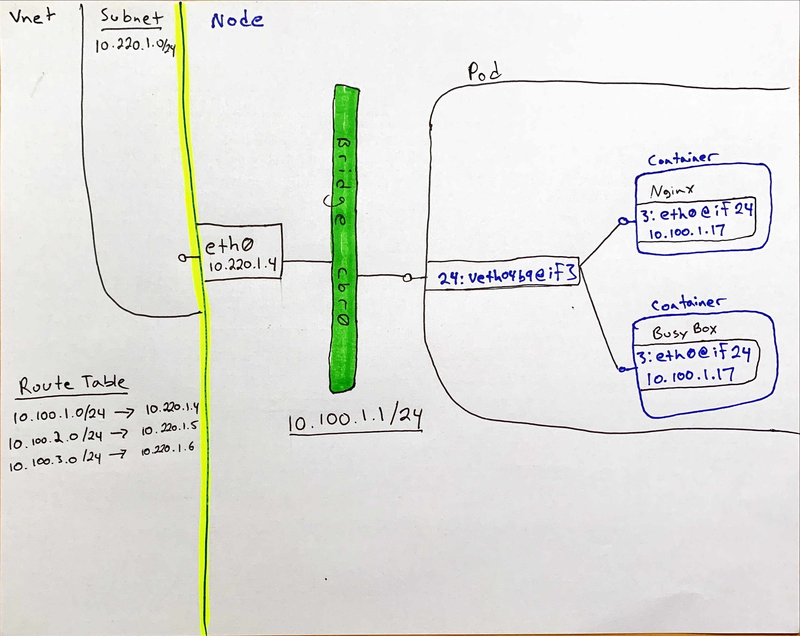

# AKS Networking Overview - Part 1: Kubenet

## Setup

For this session we'll create a resource group with a Vnet, three subnets and two AKS Clusters.

### Create Resource Group, Vnet and Subnets

```bash
RG=NetworkLab
LOC=eastus
VNET_CIDR="10.220.0.0/16"
KUBENET_AKS_CIDR="10.220.1.0/24"
AZURECNI_AKS_CIDR="10.220.2.0/24"
SVC_LB_CIDR="10.220.3.0/24"

# Create Resource Group
az group create -n $RG -l $LOC

# Create Vnet
az network vnet create \
-g $RG \
-n aksvnet \
--address-prefix $VNET_CIDR

# Create Kubenet AKS Cluster Subnet
az network vnet subnet create \
    --resource-group $RG \
    --vnet-name aksvnet \
    --name kubenet \
    --address-prefix $KUBENET_AKS_CIDR

# Get the Kubnet Subnet ID
KUBENET_SUBNET_ID=$(az network vnet show -g $RG -n aksvnet -o tsv --query "subnets[?name=='kubenet'].id")

# Create Azure CNI AKS Cluster Subnet
az network vnet subnet create \
    --resource-group $RG \
    --vnet-name aksvnet \
    --name azurecni \
    --address-prefix $AZURECNI_AKS_CIDR

# Create the subnet for Kubernetes Service Load Balancers
az network vnet subnet create \
    --resource-group $RG \
    --vnet-name aksvnet \
    --name services \
    --address-prefix $SVC_LB_CIDR
```

### Pod and Service CIDR Sizes

Before we create the cluster it's worth discussing the size of the address space (aka. cidr) for our pods and servcies. In both cases, when we're using kubenet the address range will be an 'overlay' network, which we'll explain further as we go through this guide. Since we'll generally have more pods than services in a given cluster, you can make the services cidr smaller than the pod cidr. For this walkthrough, however, I'm just leaving them both as /16.

When we create services of type 'LoadBalancer' this will trigger the creation of an Azure Load Balancer either in the cluster subnet (by default), or optionally in a user specified subnet, at which point those services will consume private address space that you will likely want to conserve. Setting the target subnet for the creation of services of type LoadBalancer is a good practice to ensure better control of overall IP usage and to enable better control of routing and network security rules. See the Azure doc on [AKS Internal LBs](https://docs.microsoft.com/en-us/azure/aks/internal-lb#specify-a-different-subnet) to see how to apply a target subnet.

### Create the Kubenet AKS Cluster

```bash
######################################
# Create the Kubenet AKS Cluster
# Note: We set a pod cidr, service cidr
# and dns service ip for demonstration
# purposes, however these are optional
#######################################
az aks create \
-g $RG \
-n kubenet-cluster \
--network-plugin kubenet \
--vnet-subnet-id $KUBENET_SUBNET_ID \
--pod-cidr "10.100.0.0/16" \
--service-cidr "10.200.0.0/16" \
--dns-service-ip "10.200.0.10" \
--enable-managed-identity

# Get Credentials
az aks get-credentials -g $RG -n kubenet-cluster

# Deploy 3 Nginx Pods across 3 nodes
kubectl apply -f nginx.yaml

# View the Services and pods
kubectl get svc
kubectl get pods -o wide --sort-by=.spec.nodeName # Sorted by node name
```

### Pod and Service CIDR behavior

Notice from your get svc and pods calls that the private IP addresses are from the pod and serivce cidr ranges you specified at cluster creation, and not from you subnet cidr.

```bash
# Subnet CIDR from network creation
KUBENET_AKS_CIDR="10.220.1.0/24"

# CIDR Values from 'az aks create'
--pod-cidr "10.100.0.0/16"
--service-cidr "10.200.0.0/16"
```

Fig. 1


To dig a bit deeper, lets ssh into the node and explore the network configuration. For this we'll use [ssh-jump](https://github.com/yokawasa/kubectl-plugin-ssh-jump/blob/master/README.md) but there are various other options, including using priviledged containers. If you do ssh to a node, you'll need to [set up ssh access](https://docs.microsoft.com/en-us/azure/aks/ssh).

```bash
# Get the managed cluster resource group and scale set names
CLUSTER_RESOURCE_GROUP=$(az aks show --resource-group $RG --name kubenet-cluster --query nodeResourceGroup -o tsv)
SCALE_SET_NAME=$(az vmss list --resource-group $CLUSTER_RESOURCE_GROUP --query "[0].name" -o tsv)

# Add your local public key to the VMSS to enable ssh access
az vmss extension set  \
    --resource-group $CLUSTER_RESOURCE_GROUP \
    --vmss-name $SCALE_SET_NAME \
    --name VMAccessForLinux \
    --publisher Microsoft.OSTCExtensions \
    --version 1.4 \
    --protected-settings "{\"username\":\"azureuser\", \"ssh_key\":\"$(cat ~/.ssh/id_rsa.pub)\"}"

az vmss update-instances --instance-ids '*' \
    --resource-group $CLUSTER_RESOURCE_GROUP \
    --name $SCALE_SET_NAME

# Get a node name and ssh-jump to it
# Make sure you jump to a node where one of your nginx pods is running
kubectl get nodes
NAME                                STATUS   ROLES   AGE    VERSION
aks-nodepool1-27511634-vmss000000   Ready    agent   4d3h   v1.17.11
aks-nodepool1-27511634-vmss000001   Ready    agent   4d3h   v1.17.11
aks-nodepool1-27511634-vmss000002   Ready    agent   4d3h   v1.17.11

# Use ssh-jump to access a node. Note that it may take a minute for the jump pod to come online
kubectl ssh-jump <Insert a node name>

# Get the docker id for the nginx pod
docker ps|grep nginx
d01940d20034        nginx                                          "/docker-entrypoint.…"   24 minutes ago      Up 24 minutes                           k8s_nginx_nginx-7cf567cc7-8879g_default_33aa572a-8816-4635-b9c4-be315b270f27_0
660dcdb7ed1c        mcr.microsoft.com/oss/kubernetes/pause:1.3.1   "/pause"                 24 minutes ago      Up 24 minutes                           k8s_POD_nginx-7cf567cc7-8879g_default_33aa572a-8816-4635-b9c4-be315b270f27_0
```

Ok, wait....why do we have two containers for this single nginx pod? Go check out the [the almight pause container](https://www.ianlewis.org/en/almighty-pause-container). In short, the other container is the '/pause' container, which is the parent container for all contianers within a given Kubernetes pod.

```bash
# Get the pid for your container
docker inspect --format '{{ .State.Pid }}' 660dcdb7ed1c
14219

# List the network interfaces for the pid
sudo nsenter -t 14219 -n ip addr
1: lo: <LOOPBACK,UP,LOWER_UP> mtu 65536 qdisc noqueue state UNKNOWN group default qlen 1000
    link/loopback 00:00:00:00:00:00 brd 00:00:00:00:00:00
    inet 127.0.0.1/8 scope host lo
       valid_lft forever preferred_lft forever
3: eth0@if19: <BROADCAST,MULTICAST,UP,LOWER_UP> mtu 1500 qdisc noqueue state UP group default
    link/ether a6:89:88:b2:e5:a6 brd ff:ff:ff:ff:ff:ff link-netnsid 0
    inet 10.100.1.14/24 scope global eth0
       valid_lft forever preferred_lft forever
```

Notice the eth0 is @if19, meaning its attached to interface 19, but what is that? If we take a look at the host machine interfaces we can see that there is an interface with the index of 19 named "vethd3b9c108@if3" as you can see in the image below, @if3 and @if19 are the link between the container network interface and the host network interface, which happens to be a veth link.

Fig 2.


Ok, so now we know how each container is connected to the a virtual ethernet interface on the host, but where does it get it's IP and how does it communicate out of the node? Our first hint is the 'cbr0' name listed in the 'ip addr' output for our veth.  Checking out the Kubernetes docs on [Kubenet](https://kubernetes.io/docs/concepts/extend-kubernetes/compute-storage-net/network-plugins/#kubenet), we know that cbr0 is the bridge network created and managed by kubenet. We can see the interface in our 'ip addr' output. Also notice that the inet value for cbr0 is 10.100.1.1/24, which happens to be our pod cidr! So cbr0 is the bridge network that the veth links are joined to. We can confirm this by using the brctl command from bridge-utils. Notice all of our veth interfaces attached to cbr0.

```bash
# Install the bridge-utils package
sudo apt update
sudo apt install bridge-utils

# Show the bridge networks on the server
brctl show
bridge name bridge id          STP enabled  interfaces
cbr0        8000.160c0cac5660  no           veth9423965c
                                            vetha1065ff2
                                            vetha33f314e
                                            vethcd3ab008
                                            vethd3b9c108
```

Further, if we look at the routes defined on our machine we can see that any traffic destined for our pod cidr should be sent to that cbr0 bridge interface, and the traffic leaving our cbr0 bridge should go to the default route (0.0.0.0)...which uses eth0 and points to our network gateway address (10.220.1.1).

```bash
# Get Routes
route -n
Kernel IP routing table
Destination     Gateway         Genmask         Flags Metric Ref    Use Iface
0.0.0.0         10.220.1.1      0.0.0.0         UG    0      0        0 eth0
10.100.1.0      0.0.0.0         255.255.255.0   U     0      0        0 cbr0
10.220.1.0      0.0.0.0         255.255.255.0   U     0      0        0 eth0
168.63.129.16   10.220.1.1      255.255.255.255 UGH   0      0        0 eth0
169.254.169.254 10.220.1.1      255.255.255.255 UGH   0      0        0 eth0
172.17.0.0      0.0.0.0         255.255.0.0     U     0      0        0 docker0
```

FINALLY, the bridge network has brought us to the NIC of our Azure node (eth0). So, now we have the network wiring in place to get packets from outside of our node to a given container, within a pod, and the wiring to get traffic out of a container and pod out through the node network interface card. There's more to cover as our packet traverses that path, in particular how Kubernetes uses iptables to direct traffic flow, but lets hold off on how iptables come into play until after we look at Azure CNI so we can compare how the Kubenet and CNI wiring differ.

We still haven't seen how traffic from a container in one pod can reach a container in a pod on another node. This is one of the fundamental ways that Azure Kubernetes Service with the kubenet plugin differs from AKS with Azure CNI. Node to node traffic is directed by an Azure Route table. Before we look at the route table, one thing to know is that traffic between pods does not go through SNAT (Source NAT). That means that when a pod sends traffic to another pod, it retains it's pod ip.

I know I said we'd cover iptables later, but just fyi...this is the set of rules that ensure packets originating from our pod cidr dont get SNAT'd to the node IP address. Notice the !10.100.0.0/16 for destination, meaning 'NOT 10.100.0.0/16' aka 'NOT our pod cidr'. That rule is saying that SNAT should ONLY happen for packets NOT destined for our cluster's pod cidr.

```bash
# Run iptables for the 'nat' table pulling the POSTROUTING chain...and do some formatting to make more pretty
iptables -t nat -nL POSTROUTING --line-numbers
Chain POSTROUTING (policy ACCEPT)
num  target     prot opt source               destination
1    KUBE-POSTROUTING  all  --  0.0.0.0/0            0.0.0.0/0            /* kubernetes postrouting rules */
2    MASQUERADE  all  --  172.17.0.0/16        0.0.0.0/0
3    MASQUERADE  all  --  0.0.0.0/0           !10.100.0.0/16        /* kubenet: SNAT for outbound traffic from cluster */ ADDRTYPE match dst-type !LOCAL
```

### Azure Route Table

When traffic is leaving our node it can be destined for:

1. Another network
1. A node in our current network
1. A pod in a node in our current network

For 1 & 2, we already saw above that our pod traffic will SNAT to the node IP address and will just go on their way along to their destination. For 3, however, the AKS kubenet implementation has an Azure Route Table that takes over. This route table is what tells Azure what node to route that pod traffic to. When nodes are added to an AKS kubenet cluster, the pod cidr is split into a /24 for each node.



As you can see below, any traffic destined to pods in the 10.100.1.0/24 cidr will next hop to 10.220.1.4. Sure enough, if I look at the pods on that node I can see that they all have ips in that 10.100.1.0/24 range.

```bash
# Get nodes to see ips
kubectl get nodes -o wide
NAME                                STATUS   ROLES   AGE     VERSION    INTERNAL-IP   EXTERNAL-IP   OS-IMAGE             KERNEL-VERSION      CONTAINER-RUNTIME
aks-nodepool1-27511634-vmss000000   Ready    agent   5d23h   v1.17.11   10.220.1.4    <none>        Ubuntu 16.04.7 LTS   4.15.0-1096-azure   docker://19.3.12
aks-nodepool1-27511634-vmss000001   Ready    agent   5d23h   v1.17.11   10.220.1.5    <none>        Ubuntu 16.04.7 LTS   4.15.0-1096-azure   docker://19.3.12
aks-nodepool1-27511634-vmss000002   Ready    agent   5d23h   v1.17.11   10.220.1.6    <none>        Ubuntu 16.04.7 LTS   4.15.0-1096-azure   docker://19.3.12

# Get pods for the node with ip 10.220.1.4 (aks-nodepool1-27511634-vmss000000)
kubectl get pods --all-namespaces -o wide --field-selector spec.nodeName=aks-nodepool1-27511634-vmss000000
NAMESPACE     NAME                                         READY   STATUS    RESTARTS   AGE     IP            NODE                                NOMINATED NODE   READINESS GATES
default       nginx-7cf567cc7-bnvk9                        1/1     Running   0          34m     10.100.1.18   aks-nodepool1-27511634-vmss000000   <none>           <none>
kube-system   coredns-869cb84759-vdh55                     1/1     Running   0          5d23h   10.100.1.5    aks-nodepool1-27511634-vmss000000   <none>           <none>
kube-system   coredns-autoscaler-5b867494f-25vlb           1/1     Running   5          6d      10.100.1.3    aks-nodepool1-27511634-vmss000000   <none>           <none>
kube-system   dashboard-metrics-scraper-5ddb5bf5c8-ph4vs   1/1     Running   0          6d      10.100.1.4    aks-nodepool1-27511634-vmss000000   <none>           <none>
kube-system   kube-proxy-2n62m                             1/1     Running   0          5d23h   10.220.1.4    aks-nodepool1-27511634-vmss000000   <none>           <none>
```

**Note:** Ignore the kube-proxy pod above, which has an ip of 10.220.1.4, which is the node ip. If you take a look at the definition of that pod you'll see that it attaches to the host network (*kubectl get pod kube-proxy-2n62m -n kube-system -o yaml|grep hostNetwork*)

### Next

Now that we have a good idea of how kubenet works in AKS, lets have a look at Azure CNI

[Azure CNI](./part2-azurecni.md)

### Big Picture

Fig 3.


## References

* [Understanding Azure Kubernetes Service Basic Networking](https://azuregulfblog.files.wordpress.com/2019/04/aks_basicnetwork_technicalpaper.pdf)
