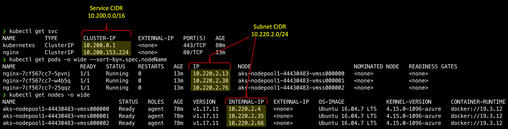
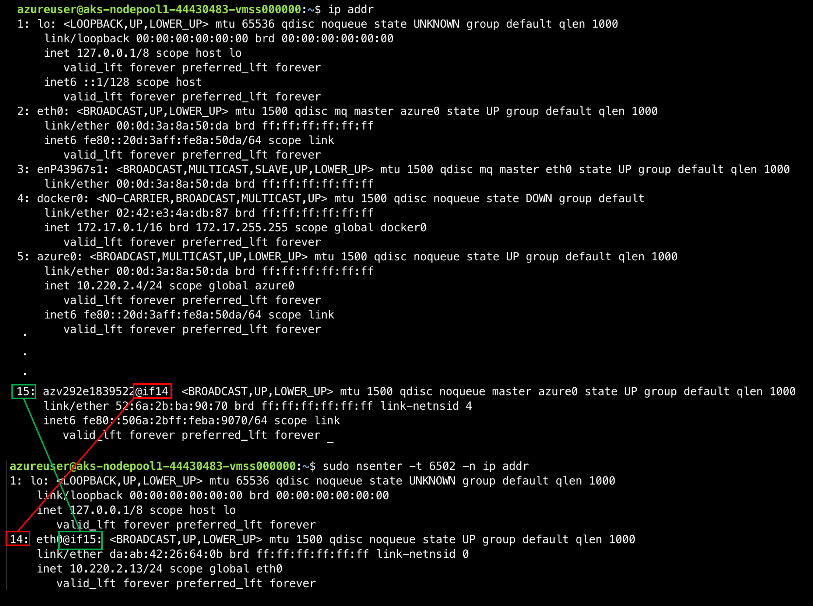
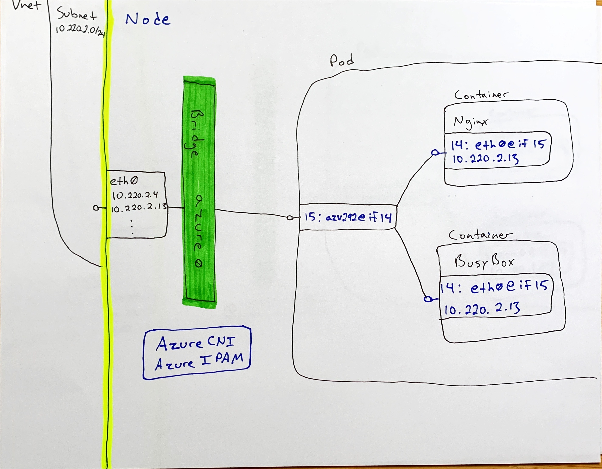

# AKS Networking Overview - Part 2: Azure CNI

## Setup
We've been through the [kubenet implementation](./part1-kubenet.md), and now we're on to Azure CNI. Lets start by creating an Azure CNI based AKS cluster. We've already created the Vnet and Subnets, so all we need to do is create the cluster.

Notice a few changes in the 'az aks create' command below.

* Cluster name to 'azurecni-cluster'
* Network Plugin to 'azure'
* Removed the '--pod-cidr' flag, as pods will be attached to the subnet directly

### Pod and Service CIDR Sizes

As noted in our kubenet walkthrough, the options we set on cluster creation will impact the size of the pod and service cidrs. The pod cidr will be based on the subnet, as noted above, however the service cidr will still be defined as a parameter on our cluster creation, and will ultimately translate to the creation of an overlay network within our cluster. As mentioned previously, this cidr can be smaller than the address space needed for pods.

Again, as we noted in the kubenet overview, when a service of type 'LoadBalancer' is created, you will want to [specify a target subnet](https://docs.microsoft.com/en-us/azure/aks/internal-lb#specify-a-different-subnet) where the Azure Loadbalancer frontend will live.

### Create the Kubenet AKS Cluster
```bash
# We'll re-use the RG and LOC, so lets set those
RG=NetworkLab
LOC=eastus

# Get the Azure CNI Subnet ID
AZURECNI_SUBNET_ID=$(az network vnet show -g $RG -n aksvnet -o tsv --query "subnets[?name=='azurecni'].id")

######################################
# Create the Azure CNI AKS Cluster
# Note: We set a service cidr
# and dns service ip for demonstration
# purposes, however these are optional
#######################################
az aks create \
-g $RG \
-n azurecni-cluster \
--network-plugin azure \
--vnet-subnet-id $AZURECNI_SUBNET_ID \
--service-cidr "10.200.0.0/16" \
--dns-service-ip "10.200.0.10" \
--enable-managed-identity

# Get Credentials
az aks get-credentials -g $RG -n azurecni-cluster

# Deploy 3 Nginx Pods across 3 nodes
kubectl apply -f nginx.yaml

# View the Services and pods
kubectl get svc
kubectl get pods -o wide --sort-by=.spec.nodeName # Sorted by node name
```

### Pod and Service CIDR behavior

Notice from your get svc and pods calls that, while the service ip addresses are from the service cidr we provided in cluster creation, the pods have IP addresses from the subnet cidr.

```bash
# Subnet CIDR from network creation
AZURECNI_AKS_CIDR="10.220.2.0/24"

# CIDR Values from 'az aks create'
--service-cidr "10.200.0.0/16"
```

Fig. 1


As we did with kubenet, to dig a bit deeper, lets ssh into the node and explore the network configuration. Again, we'll use [ssh-jump](https://github.com/yokawasa/kubectl-plugin-ssh-jump/blob/master/README.md). Don't forget that you need to [set up ssh access](https://docs.microsoft.com/en-us/azure/aks/ssh) first.

```bash
# Get the managed cluster resource group and scale set names
CLUSTER_RESOURCE_GROUP=$(az aks show --resource-group $RG --name azurecni-cluster --query nodeResourceGroup -o tsv)
SCALE_SET_NAME=$(az vmss list --resource-group $CLUSTER_RESOURCE_GROUP --query "[0].name" -o tsv)

# Add your local public key to the VMSS to enable ssh access
az vmss extension set  \
    --resource-group $CLUSTER_RESOURCE_GROUP \
    --vmss-name $SCALE_SET_NAME \
    --name VMAccessForLinux \
    --publisher Microsoft.OSTCExtensions \
    --version 1.4 \
    --protected-settings "{\"username\":\"azureuser\", \"ssh_key\":\"$(cat ~/.ssh/id_rsa.pub)\"}"

az vmss update-instances --instance-ids '*' \
    --resource-group $CLUSTER_RESOURCE_GROUP \
    --name $SCALE_SET_NAME

# Get a node name and ssh-jump to it
# Make sure you jump to a node where one of your nginx pods is running
kubectl get nodes
NAME                                STATUS   ROLES   AGE   VERSION
aks-nodepool1-44430483-vmss000000   Ready    agent   90m   v1.17.11
aks-nodepool1-44430483-vmss000001   Ready    agent   90m   v1.17.11
aks-nodepool1-44430483-vmss000002   Ready    agent   90m   v1.17.11

# Use ssh-jump to access a node. Note that it may take a minute for the jump pod to come online
kubectl ssh-jump <Insert your node name>

# Get the docker id for the nginx pod
docker ps|grep nginx
8bdb2bd78165        nginx                                          "/docker-entrypoint.…"   26 minutes ago      Up 26 minutes                           k8s_nginx_nginx-7cf567cc7-5pvnj_default_56899928-244b-485e-846b-5302430a0c45_0
1f840366a5ea        mcr.microsoft.com/oss/kubernetes/pause:1.3.1   "/pause"                 26 minutes ago      Up 26 minutes                           k8s_POD_nginx-7cf567cc7-5pvnj_default_56899928-244b-485e-846b-5302430a0c45_0
```

So far, all the same as when we tested with kubenet. We have two containers because of the /pause container we mentioned in [part 1](./part1-kubenet.md). Now lets dig into the newtork stack.

```bash
# Get the pid for your container
docker inspect --format '{{ .State.Pid }}' 8bdb2bd78165
6502

# List the network interfaces for the pid
sudo nsenter -t 6502 -n ip addr
1: lo: <LOOPBACK,UP,LOWER_UP> mtu 65536 qdisc noqueue state UNKNOWN group default qlen 1000
    link/loopback 00:00:00:00:00:00 brd 00:00:00:00:00:00
    inet 127.0.0.1/8 scope host lo
       valid_lft forever preferred_lft forever
14: eth0@if15: <BROADCAST,UP,LOWER_UP> mtu 1500 qdisc noqueue state UP group default qlen 1000
    link/ether da:ab:42:26:64:0b brd ff:ff:ff:ff:ff:ff link-netnsid 0
    inet 10.220.2.13/24 scope global eth0
       valid_lft forever preferred_lft forever
```

Ok, so this all look familiar as well. We have an eth0@if15. This interface has an IP address from our Azure CNI subnet. Now lets look at the host interfaces to see what we have going on there. Yup....looks the same as kubenet...mostly. We have an interface indexed at 14 named eth0@if15 in the container linked to an interface indexed at 15 on the host named azv292e1839522@if14. The naming is different (i.e. not veth...) but it's still a veth interface.

Fig 2.


We can also see that our veth interface (azv292e1839522) is associated to a bridge network. In kubenet this bridge was called 'cbr0', and here it's called azure0. Lets install and run brctl like we did for kubenet.

```bash
# Install the bridge-utils package
sudo apt update
sudo apt install bridge-utils

# Show the bridge networks on the server
brctl show
bridge name bridge id           STP enabled interfaces
azure0      8000.000d3a8a50da   no          azv152f0ee345a
                                            azv3f6157ae51b
                                            azv8bdc5c14d80
                                            azv8ec44ee2325
                                            azvb1f7346f51b
                                            eth0
docker0		8000.0242e34adb87	no
```

Looks pretty much the same, but in this case eth0 is on the bridge. So eth0 is getting it's IP address the same way the rest of the pods are. Now lets look at the routes on the host:

```bash
# Get Routes
route -n
Kernel IP routing table
Destination     Gateway         Genmask         Flags Metric Ref    Use Iface
0.0.0.0         10.220.2.1      0.0.0.0         UG    0      0        0 azure0
10.220.2.0      0.0.0.0         255.255.255.0   U     0      0        0 azure0
172.17.0.0      0.0.0.0         255.255.0.0     U     0      0        0 docker0
```

Nice! We can see that the azure0 interface has the subnet gateway IP as it's gateway, so azure0 interacts directly with the subnet! Also we can see that inbound traffic for our cluster address space (10.220.2.0/24) will also use the azure0 network.

We have the wiring from the container through to the network all sorted out. The only part we're missing is understanding how an IP address from an Azure subnet gets assigned, since there are multiple hosts constantly adding and dropping pods and there-by adding and dropping ips. This is where the CNI part of Azure CNI comes into play. Azure CNI is an implementation of the [Container Network Interface](https://github.com/containernetworking/cni/blob/master/README.md) specification. Azure CNI is deployed on each node, and defined via a flag as the CNI plugin when the kubelet process starts. Additionally, CNI implementations are reponsible for providing an IPAM (IP Address Management) implementation for IP address assignment.

Looking at the [Azure CNI docs](https://github.com/Azure/azure-container-networking/blob/master/docs/cni.md) we can see that there are [log files](https://github.com/Azure/azure-container-networking/blob/master/docs/cni.md#logs) for the CNI available at /var/log/azure-vnet.log. If I tail that file I can see the CNI plugin checking in from time to time (about every 5s) on the network interfaces. If I delete and re-apply my nginx deployment...now I can see all the magic flowing through that log.

Below is a very abbreviated version of what you'd see in your logs, but have a look through and see if you can see what's going on based on how we know the overall network stack works so far.

```bash
# Tail the CNI logs
tail /var/log/azure-vnet.log -f
```

1. Processing ADD command with args {ContainerID:116419acc6958dbaa1f80380eee6762928ead0caec83d0174fc5daa91a110897 Netns:/proc/19263/ns/net IfName:eth0 Args:IgnoreUnknown=1;K8S_POD_NAMESPACE=default;K8S_POD_NAME=nginx-7cf567cc7-bgc82;K8S_POD_INFRA_CONTAINER_ID=116419acc6958dbaa1f80380eee6762928ead0caec83d0174fc5daa91a110897 Path:/opt/cni/bin StdinData:{"bridge":"azure0","cniVersion":"0.3.0","ipam":{"type":"azure-vnet-ipam"},"ipsToRouteViaHost":["169.254.20.10"],"mode":"bridge","name":"azure","type":"azure-vnet"}}
1. Read network configuration...
1. Found network azure with subnet 10.220.2.0/24...
1. Calling plugin azure-vnet-ipam ADD ....
1. Plugin azure-vnet-ipam returned result:IP:[{Version:4 Interface:<nil> Address:{IP:10.220.2.11 Mask:ffffff00}....
1. Creating endpoint 116419ac-eth0
1. Creating veth pair azvb1f7346f51b azvb1f7346f51b2
1. Adding ARP reply rule for IP address 10.220.2.11/24
1. Adding static arp for IP address 10.220.2.11/24 and MAC ea:99:18:36:3e:10 in VM
1. Setting link azvb1f7346f51b2 netns /proc/19263/ns/net
1. Adding IP address 10.220.2.11/24 to link eth0

The short translated version of the above is as follows:

1. The assignment of a new pod to a node triggered an 'ADD' call to the Azure CNI plugin on my node
1. Azure CNI checked out the network configuration and found the subnet cidr
1. Azure CNI asked the IPAM (IP Address Management) plugin to give it an available address
1. IPAM responded with 10.220.2.11
1. CNI proceeded to create the:
    * The veth pair
    * APR entry
    * Assignment of the veth link to the container network namespace
    * Association of the IP address with eth0

### Finally!

From all of the above we can see that, largely, the network stack is the same between kubenet and Azure CNI. Both rely on veth interfaces bound between a bridge network and the container network namespace. The difference comes in at the CNI and IPAM level. With kubenet the implementation creates an overlay network within the bridge which the IPAM uses to assign pod IP address, where with Azure CNI we're using the Azure CNI plugin and IPAM to handle ip assignment from the cluster/nodepool subnet rather than creating an overlay.

The only other thing to look at, which we touched on in part 1, is how iptables come into the picture. Let's dig into the iptables rules in both kubenet and Azure CNI, breifly.

### Next

[IPTables](./iptables.md)

### Big Picture

Fig 3.

