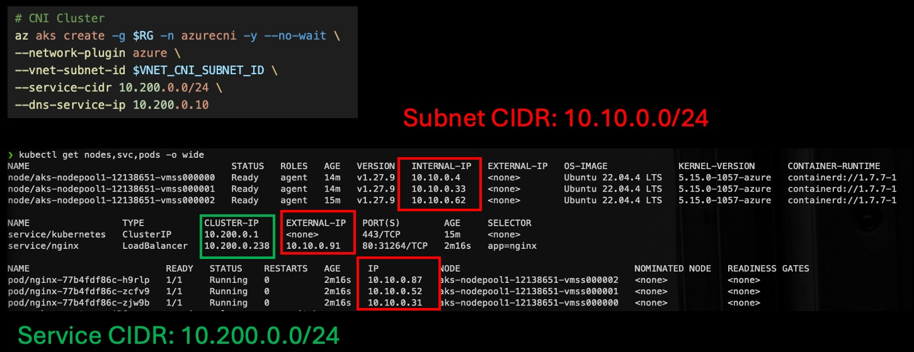
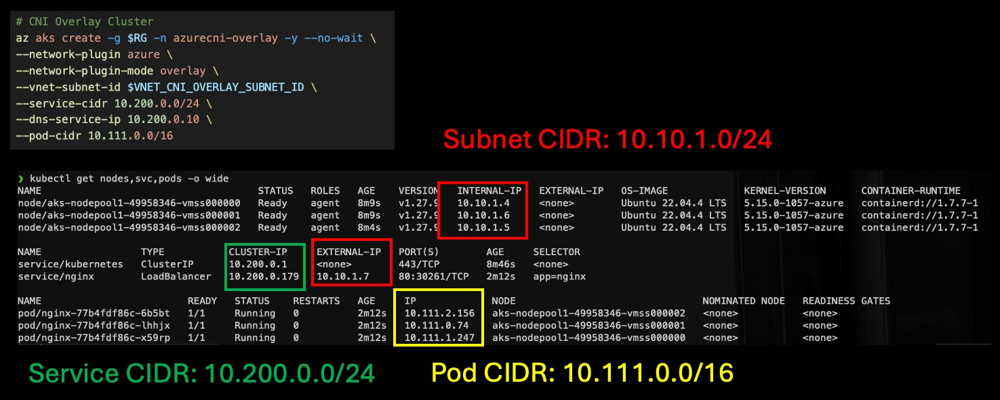

# AKS Networking Demo

## Create the network
```bash
RG=EphNetworkLab
LOC=eastus
VNET_NAME=aksnetworklab-vnet
# Create Resource Group 
az group create -n $RG -l $LOC

# Create Vnet and subnet
az network vnet create \
-g $RG \
-n $VNET_NAME \
--address-prefix 10.10.0.0/16 \
--subnet-name aks-cni-subnet \
--subnet-prefix 10.10.0.0/24

az network vnet subnet create \
--resource-group $RG \
--vnet-name $VNET_NAME \
--name aks-cni-overlay-subnet \
--address-prefix 10.10.1.0/24

az network vnet subnet create \
--resource-group $RG \
--vnet-name $VNET_NAME \
--name aks-kubenet-subnet \
--address-prefix 10.10.2.0/24

# Get the cluster VNet Subnet ID
VNET_CNI_SUBNET_ID=$(az network vnet subnet show -g $RG --vnet-name $VNET_NAME -n aks-cni-subnet -o tsv --query id)
VNET_CNI_OVERLAY_SUBNET_ID=$(az network vnet subnet show -g $RG --vnet-name $VNET_NAME -n aks-cni-overlay-subnet -o tsv --query id)
VNET_KUBENET_SUBNET_ID=$(az network vnet subnet show -g $RG --vnet-name $VNET_NAME -n aks-kubenet-subnet -o tsv --query id)
```

## Craete a sammple workload

Create a new file called 'deployment.yaml' with the following:

```yaml
apiVersion: apps/v1
kind: Deployment
metadata:
  labels:
    app: nginx
  name: nginx
spec:
  replicas: 3
  selector:
    matchLabels:
      app: nginx
  template:
    metadata:
      labels:
        app: nginx
    spec:
      containers:
      - image: nginx
        name: nginx
---
apiVersion: v1
kind: Service
metadata:
  labels:
    app: nginx
  name: nginx
  annotations:
    service.beta.kubernetes.io/azure-load-balancer-internal: "true"
spec:
  ports:
  - port: 80
    protocol: TCP
    targetPort: 80
  selector:
    app: nginx
  type: LoadBalancer
```

## Create the Clusters

### Azure CNI
```bash
# CNI Cluster
az aks create -g $RG -n azurecni -y --no-wait \
--network-plugin azure \
--vnet-subnet-id $VNET_CNI_SUBNET_ID \
--service-cidr 10.200.0.0/24 \
--dns-service-ip 10.200.0.10 

az aks get-credentials -g $RG -n azurecni

kubectl apply -f deployment.yaml
kubectl get nodes,svc,pods -o wide
```



### CNI Overlay

```bash
# CNI Overlay Cluster
az aks create -g $RG -n azurecni-overlay -y --no-wait \
--network-plugin azure \
--network-plugin-mode overlay \
--vnet-subnet-id $VNET_CNI_OVERLAY_SUBNET_ID \
--service-cidr 10.200.0.0/24 \
--dns-service-ip 10.200.0.10 \
--pod-cidr 10.111.0.0/16 

az aks get-credentials -g $RG -n azurecni-overlay

kubectl apply -f deployment.yaml
kubectl get nodes,svc,pods -o wide
```



### Kubenet
```bash
# Kubnet Cluster
az aks create -g $RG -n kubenet -y --no-wait \
--network-plugin kubenet \
--vnet-subnet-id $VNET_KUBENET_SUBNET_ID \
--service-cidr 10.200.0.0/24 \
--dns-service-ip 10.200.0.10 \
--pod-cidr 10.111.0.0/16 

az aks get-credentials -g $RG -n kubenet

kubectl apply -f deployment.yaml
kubectl get nodes,svc,pods -o wide
```
